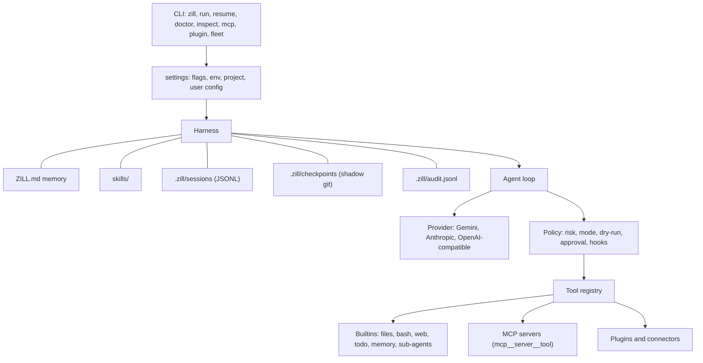

<p align="center">
  
</p>

# ZILL Harness

**ZILL** is a concise coding-agent harness: a terminal coding agent you can
trust, extend and read, built with as little code as possible. It has zero
dependencies. It uses the Python standard library only, and one HTTPS call per
model turn.

It works with Gemini, Claude, OpenAI and OpenAI-compatible or local models. It
connects to MCP servers, plugins and connectors, and every tool, wherever it
comes from, passes through one policy, one dry-run switch and one audit log.

[](https://github.com/AkbarSheikh-debug/ZILL-Harness/actions/workflows/ci.yml)
[](LICENSE)

## Install

One line. The installer uses uv, pipx or pip, and if there is no Python it
fetches uv, which brings its own Python.

```sh
# macOS, Linux, WSL
curl -fsSL https://raw.githubusercontent.com/AkbarSheikh-debug/ZILL-Harness/main/install.sh | sh
```

```powershell
# Windows (PowerShell)
irm https://raw.githubusercontent.com/AkbarSheikh-debug/ZILL-Harness/main/install.ps1 | iex
```

Or with Python 3.10 or newer:

```sh
pip install git+https://github.com/AkbarSheikh-debug/ZILL-Harness.git
# once v1.0.0 is published on PyPI:
pip install zill-harness
```

Then start it. The first time, ZILL asks you to paste an API key:

```sh
zill            # no key yet? it runs `zill setup` for you
zill setup      # add or change keys any time (input is hidden)
zill doctor     # check that everything is ready
```

Keys are saved to `~/.zill/credentials.json`, readable only by you.
Environment variables work too, and always take priority.

## Use it

```sh
zill                                               # interactive, safe mode
zill run "add a --json flag to cli.py" -d ./myproject   # headless (same as -p)
zill resume -d ./myproject                         # continue the latest session
zill run "fix the failing test" --verify "pytest -q"    # done only when the check passes
zill run "summarise the open TODOs" --json         # one JSON object, for scripts
```

| Command | What it does |
|---|---|
| `zill setup` | Paste API keys (hidden input). |
| `zill doctor` | Check Python, git, config, keys, MCP servers and plugins, with fixes. |
| `zill inspect` | Show what a run would get: model, mode, and every tool with its source and risk. |
| `zill sessions` | List saved sessions. |
| `zill checkpoints` / `zill undo [id]` | List snapshots, and take changes back. |
| `zill fleet jobs.json` | Run many `{name, workdir, task}` jobs in parallel. |
| `zill mcp add \| trust \| list \| remove \| serve` | Manage MCP servers, or serve ZILL's tools over MCP. |
| `zill plugin list \| inspect \| enable \| disable` | Manage plugins and connectors. |

| Flag | Meaning |
|---|---|
| `-d, --workdir` | Directory the agent works in (default `.`). |
| `-m, --model` | `provider:model`, see Providers. |
| `--mode` | `safe` (asks before changes), `yolo` (no questions) or `read-only`. Default: `safe` interactively, `yolo` headless. |
| `--profile` | `coding` (default), `reviewer` and `research` (read-only), or `writing` (no shell). |
| `--dry-run` | Plan and inspect only: every call that is not a read is blocked. |
| `--verify` | A run is done only when this command passes. |
| `--json` | Headless: print one JSON object with the result, usage and cost. |
| `--resume` | Load the newest session in the workdir first. |

In interactive mode, type `/help` for `/cost /model /mode /compact /clear /todo
/undo /checkpoints /sessions /skills /exit`. Replies stream as they are written.

### Providers

| Provider | Example `-m` | Key |
|---|---|---|
| Google Gemini | `gemini:gemini-3.6-flash` | `GEMINI_API_KEY` |
| Anthropic Claude | `anthropic:claude-opus-5` | `ANTHROPIC_API_KEY` |
| OpenAI | `openai:gpt-5` | `OPENAI_API_KEY` |
| OpenRouter | `openrouter:<vendor>/<model>` | `OPENROUTER_API_KEY` |
| Groq | `groq:<model>` | `GROQ_API_KEY` |
| DeepSeek | `deepseek:deepseek-chat` | `DEEPSEEK_API_KEY` |
| Ollama / LM Studio (local) | `ollama:qwen3`, `lmstudio:<model>` | none |

With no `-m`, ZILL uses `ZILL_MODEL`, then your config, then the default model
of the first provider you have a key for. `ZILL_BASE_URL` points a provider at
another endpoint.

### Configure it

- **`~/.zill/config.json`** holds your defaults: `model`, `mode`, `profile`,
  and `prices` in USD per million tokens, for models without built-in prices.
- **`.zill/project.json`** holds per-project settings: `model`, `mode`,
  `profile`, `verify`, `hooks`.

```json
{
  "verify": "python -m pytest -q",
  "hooks": [
    {"when": "after", "tool": "write_file", "match": "*.py", "run": "ruff format {path}"},
    {"when": "before", "match": "generated/*", "run": "python -c \"raise SystemExit('generated')\""}
  ]
}
```

Precedence is flags, then environment, then project, then user, then defaults.
A project file can only make the mode *stricter*, so cloning a repo can never
switch you into `yolo`.

## How ZILL works



- **A model call.** The loop sends neutral messages to `provider.complete()`.
  `provider.py` reads `provider:model`, finds the key, and forwards the call to
  an adapter in `providers/`, the only code that knows each wire format.
- **A tool is registered.** A tool is a function with a JSON schema: `@tool`
  builds one from a Python signature, and MCP servers and plugins produce the
  same `Tool` objects with a `source` and a `risk`.
- **A tool is approved.** Before any call, `Policy.decide()` classifies its risk
  (`bash` by what the command does). It denies destructive calls in every mode,
  applies dry-run and read-only, and in safe mode asks you.
- **A tool runs, or fails.** Before-hooks and a checkpoint run first, then the
  tool, then after-hooks. Exceptions and refusals become `ERROR: ...` or
  `BLOCKED: ...` results that the model reads. The loop never crashes because a
  tool did.
- **State survives a crash.** Every message is appended to a JSONL session before
  the next step. `--resume` repairs a torn last line and marks interrupted calls.
- **Context is compacted.** Near 60% of the model's window, older turns are
  summarised, the recent tail is kept word for word, and the todo list is carried over.
- **Memory persists.** `ZILL.md` is loaded into every system prompt, and the
  `remember` tool appends to it. Once web, MCP or connector output has entered
  a task, any memory write needs your approval, so a page cannot plant a lasting instruction.
- **A stuck model is stopped.** The same call with the same result three times
  draws a warning; five times ends the run with a summary instead of burning tokens.
- **Skills shape behaviour.** A one-line catalog sits in the prompt, and
  `use_skill` loads the full `SKILL.md` only when it's needed.
- **Sub-agents work in isolation.** `spawn_agent` runs a child with a clean
  context, under the same policy, tools and audit log. Depth is bounded.
- **MCP servers, plugins and connectors** become tools, so everything above
  applies to them unchanged.
- **Everything is tested.** `python -m unittest discover` runs offline with a
  scripted model, and `evals/run.py` runs real-model tasks with mechanical checks.

| Concept | What it is |
|---|---|
| **Tool** | One callable operation the model can use. |
| **Skill** | Instructions in `skills/<name>/SKILL.md`, loaded when relevant. Not code. |
| **MCP server** | An external program offering tools over the Model Context Protocol. |
| **Plugin** | Local Python code that registers tools. |
| **Connector** | A plugin that integrates a service and declares the credentials it needs. |
| **Sub-agent** | A child agent with a clean context, for a self-contained task. |
| **Profile** | A preset prompt, tool allowlist and strictest mode. |

## Extend it

### Register a tool

```python
import urllib.request

from zill import Harness, Policy, tool


@tool("Fetch a URL and return the first 4000 characters.", risk="network", url="An http(s) URL")
def fetch(url):
    with urllib.request.urlopen(url, timeout=30) as response:
        return response.read(4000).decode("utf-8", errors="replace")


agent = Harness("./research", policy=Policy("safe"), extra_tools=[fetch])
print(agent.run("Fetch https://example.com and summarise it in NOTES.md"))
```

### Load a plugin

```sh
mkdir -p .zill/plugins && cp -r examples/plugins/hello_plugin .zill/plugins/hello
zill plugin enable hello      # shows its permissions, then asks
```

A plugin is a folder with a `manifest.json` and a module whose `register(registry)`
calls `registry.add_tool(...)`. Each tool's risk must be one of the permissions the
manifest declares. The model sees the tool as `plugin__hello__hello`.

### Build a connector

A connector is a plugin with `"kind": "connector"` that declares its credentials:

```json
{"name": "issues", "version": "0.1.0", "entrypoint": "connector:register",
 "kind": "connector", "permissions": ["network"], "credentials": ["ISSUES_TOKEN"]}
```

Its tools read `registry.credential("ISSUES_TOKEN")`. If the credential is
missing, they answer `ERROR: issues connector is not configured` instead of
failing. See `examples/connectors/local_notes` for a complete connector that
needs no account.

### Connect an MCP server

```sh
zill mcp add github --env GITHUB_TOKEN='${GITHUB_TOKEN}' -- npx -y @modelcontextprotocol/server-github
zill mcp list --tools         # tools appear as mcp__github__<tool>
```

A server only sees the environment variables you give it. `.zill/mcp.json` from
a cloned project needs `zill mcp trust NAME` first.

### Serve ZILL over MCP

```sh
zill mcp serve -d ./myproject --tools read_file,grep,list_files
```

Another agent or editor can start this command as an MCP server. Every call goes
through ZILL's jail, policy and audit log, read-only by default.

### Run many agents at once

```python
from zill import Harness, run_fleet

jobs = [{"name": "api", "workdir": "./api", "task": "add request logging"},
        {"name": "web", "workdir": "./web", "task": "fix the failing build"}]
for result in run_fleet(jobs, lambda workdir: Harness(workdir)):
    print(result["name"], result["ok"], result["report"][:80])
```

## Trust and safety

- **Undo:** before every change, ZILL snapshots the project into
  `.zill/checkpoints`, and `zill undo` takes changes back one at a time. Your own
  `.git` is never touched.
- **Audit:** every tool call is recorded in `.zill/audit.jsonl` with its source,
  risk, decision, duration and status, with secrets redacted.
- **Approval:** nothing shipped inside a project, whether MCP servers or plugins,
  runs until you approve it. Approvals are pinned to a fingerprint, so an edit
  needs approval again.
- **Not a sandbox:** the file tools can't leave the workdir, but `bash` can.
  Use `safe` mode, or run untrusted work in a container. Read
  [SECURITY.md](SECURITY.md).

## Test it

```sh
python -m unittest discover                         # offline: no API key needed
python evals/run.py -m gemini:gemini-3.6-flash      # real model: spends API quota
python evals/run.py --list                          # coding, web, security, memory, mcp, plugins, connectors
```

## Anatomy

| File | What it adds |
|---|---|
| `loop.py` | The agent loop: call the model, run the tools it asks for, repeat. |
| `provider.py`, `providers/` | One neutral `complete()` and one adapter per wire format, with streaming and quota-aware retries. |
| `tools.py` | `@tool` and the core tools: read, write, edit, bash, list, grep. File paths are confined to the workdir. |
| `web.py` | `web_fetch`, plus `web_search` with a Brave or Tavily key. |
| `security.py` | `Policy.decide()`: risk classification, modes, dry-run, approvals. |
| `audit.py` | The redacted audit log. |
| `harness.py` | Wires every layer to one workdir, and flushes each message to disk before the next step. |
| `session.py` | Crash-safe JSONL transcripts with repair on load. |
| `context.py` | Compaction within the token budget. |
| `memory.py` | `ZILL.md` memory and the system prompt. |
| `skills.py` | The on-demand skills catalog. |
| `subagent.py` | `spawn_agent`, with bounded depth. |
| `todo.py` | The checklist tool. |
| `checkpoints.py` | Shadow-git snapshots and undo. |
| `hooks.py`, `config.py`, `settings.py`, `profiles.py` | Project automation, config, run settings, presets. |
| `credentials.py`, `trust.py`, `cost.py` | Keys and redaction, approvals, and the cost meter. |
| `cli.py`, `commands.py` | The terminal front door and subcommands. |
| `fleet.py` | Parallel runs. |
| `mcp/`, `plugins/` | Edge packages: MCP client and server, plugins and connectors. |

## Contributing

ZILL stays small on purpose: zero runtime dependencies, a 3,500-line core, and
1,500 lines for edge packages, all enforced in CI. Fork it, branch, and send a
pull request. Start with [CONTRIBUTING.md](CONTRIBUTING.md) and
[ROADMAP.md](ROADMAP.md).

## License

[MIT](LICENSE) © 2026 Akbar Sheikh and ZILL Harness contributors.
